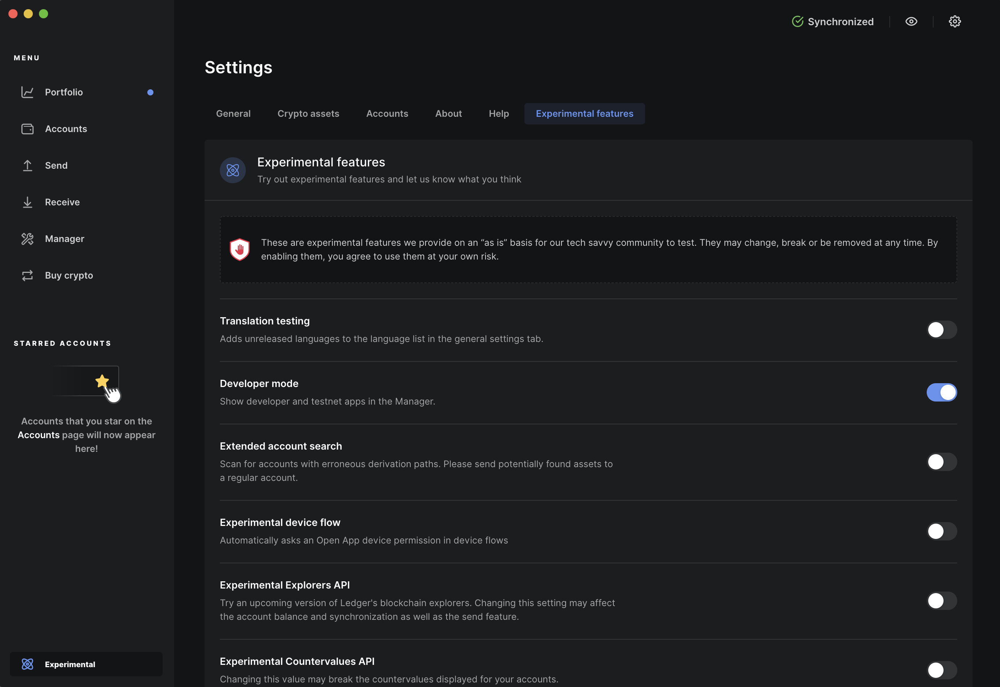

要使用 Lotus 接收和发送 FIL 您需要安装好[Lotus 节点并处于运行中]().

## 关于钱包地址

在使用钱包时，一个账户是由其 [地址](https://docs.filecoin.io/about-filecoin/how-filecoin-works/#addresses) 来识别的.  Filecoin 地址总是以字母 `f` 和一个表示地址类型的数字开头。

Filecoin 账户有两种地址，较长的 `公钥地址` 和较短的 `ID` 地址。两个地址指的是同一个账户并可用钱包发送和接收 FIL。

### 公钥地址

[公钥地址](https://docs.filecoin.io/about-filecoin/how-filecoin-works/#public-key-addresses-f1-and-f3) 直接从加密密钥产生。公钥地址, 取决于所使用的加密钥类型, 以字符 `f1` (secp256k1) 或 `f3` (BLS) 开头.

这是 secp256k1 公钥地址的范例: `f1abjxfbp274xpdqcpuaykwkfb43omjotacm2p3za`.

公钥地址是Filecoin账户最常见的方式，它们被[Ledger](https://ledger.com)等硬件钱包所支持。

由于公钥地址不依赖于任何区块链状态，因此它们被认为是[健壮的](https://docs.filecoin.io/about-filecoin/how-filecoin-works/#robust-addresses-versus-id-addresses) 建议可用于大多数涉及 FIL 的转账. 例如经过交易所将 FIL 发送给另一个用户。

### ID地址

与公钥地址相比，ID 地址是一种精简且又“人性化”的账户识别。 ID 地址都以字符 `f0` 开头，后跟一数字序列，例如: `f033259`.

Filecoin 帐户的每个 ID 地址都有一个备用公钥地址对应同一帐户。您可以透过 Filecoin 区块浏览器 [FilFox](https://filfox.info/) 的公钥地址搜索来找到任何公钥的 ID 地址。

因为它们比公钥地址更精简，所以参与者时经常使用 ID 地址称呼存储供应商和其他长期存在的 Filecoin [Actors](https://docs.filecoin.io/about-filecoin/how-filecoin-works/#actors)。由于这些参与者收到大量消息，精简的地址可以显著节省 gas 费用。多重签名钱包是一种 Actors。

虽然您可以使用钱包将 FIL 发送到 ID 地址，但您应该首先在[FilFox](https://filfox.info/) 上查看帐户的详细数据，查看帐户的创建时间以及相对应的公钥地址。如果地址是新近创建的[（在最后期限内）](https://docs.filecoin.io/reference/glossary/#finality)，之后随着网络达成共识它有可能被重新分配，所以就应该使用公钥地址。　

有关地址的更多信息可以在 [Filecoin运行方式](https://docs.filecoin.io/about-filecoin/how-filecoin-works/#addresses) 找到。

## 创建钱包

使用 Lotus 创建钱包非常简单, 有多种钱包类型可选。

### 创建BLS钱包

```shell
lotus wallet new bls
```

### 创建secp256k1钱包

```shell
lotus wallet new
```

### 创建多重签名钱包

```shell
lotus msig create address1 address2..
```

这将创建一个新地址并打印出来。您可以分辨出主网mainnet与测试网testnet，因为以 f 开头代表主网，t 开头代表测试网。


钱包内地址的数据存在 `~/.lotus/keystore`（或 `$LOTUS_PATH/keystore`）中。删除这些文件夹也会删除密钥，也会失去对这些钱包中任何资金的控制。我们建议您在创建钱包后[立即备份](#exporting-and-importing-addresses) 或使用[硬件钱包](#ledger).


## 列出钱包地址

您可以根据需要创建任意数量的地址。其中之一将是 _默认地址_ 。

您可以看到当前节点的所有钱包地址列表:

```shell
lotus wallet list
```

您可以使用以下指令查看默认钱包地址:

```shell
lotus wallet default
```

如需要也可以将默认地址更改为其他地址:

```shell
lotus wallet set-default <address>
```

## 获取FIL

对于非主网网络，可以从代币水龙头中获取 `FIL`。 [网络板面](https://network.filecoin.io) 上提供了代币水龙头列表。在主网上最简单的方法是从交易所购买 `FIL`。并非所有交易所都支持 `FIL`，因此请在注册前先研究。

收到 `FIL` 后，使用 `wallet balance` 检查您的余额:

```shell
lotus wallet balance
```

请记得只有当您的守护程序完全同步时才会看到最新的余额。

## 发送FIL

使用 `send` 命令后跟接收地址和要发送的 `FIL` 数量

```shell with-output
# lotus send <target address> <FIL amount>
lotus send f1zp2... 3
```
```
bafy1...
```

交易成功后Lotus 会输出一个交易Hash. 您可以使用 [Filecoin 浏览器](https://docs.filecoin.io/get-started/explore-the-network/#block-explorers) 查看此交易的详细数据。

Lotus 假设您想从 _默认地址_ 发送 `FIL`。要从特定地址发送 `FIL`，请使用 `--from` 后跟要发送 `FIL` 的地址。此地址必须已创建或已导入到您的 Lotus 节点。

```shell with-output
# lotus send --from=<sender address> <target address> <FIL amount>
lotus send --from f1zp2... f15zt... 3.141
```
```
bafy2...
```

关于高级发送选项:

```shell
lotus send --help
```

#### 指定调用参数

如果要使用 `lotus send` 指定调用参数，可以使用以下代码片段获取编码参数

```shell
lotus chain encode params --encoding=hex <toAddr> <method id> <params>
```

映射方法 <> 方法 id 可以在 [Filecoin GitHub 仓库](https://github.com/filecoin-project/specs-actors/blob/master/actors/builtin/methods.go) 中找到。

要发送，执行:

```shell
lotus send --params-hex=<encoded output from the previous step>
```

### 手续费

每笔发送 FIL 的交易都会根据其 gas 使用量支付额外费用。在  [Filecoin 的工作原理指引](https://docs.filecoin.io/about-filecoin/how-filecoin-works/#the-network) 中解释了 Gas 和费用。Lotus 会自动预设所有必要的值。但您可能希望在发送指令中使用 `--gas-feecap` 标志以避免在网络拥塞严重时出现意外。有关消息和费用的更多资料请查看[消息池指导]() and [Gas 费](https://docs.filecoin.io/about-filecoin/how-filecoin-works/#gas-fees) 章节.

## 导出和导入地址


请确保您地址的私钥安全！不要与任何人分享！将其存放在安全的位置！


您可以导出和重新导入钱包，包括不同的 Lotus 节点。使用 `wallet export` 从节点导出地址:

```shell
lotus wallet export <address> > <address>.key
```

使用 `wallet import` 将地址导入节点:

```shell
lotus wallet import <address>.key
```

还有:

### 离线节点

每个节点将其钱包存储在 `~/.lotus/keystore` 中:

```
~/.lotus/keystore/
├── MF2XI2...
├── MRSWMYLVNR...
├── NRUWE4BSOA...
├── O5QWY3DFOQWWMM3RNZSXI6TKOJYHQYTMMQZHQNDBNRY...
└── O5QWY3DFOQWWMM3VOBZHAZLCOIZGINLDMRZWWNLMNJS...
```

要在节点离线时导出钱包，请将这些文件 _从_ `~/.lotus/keystore` 复制到另一个位置。要导入此钱包，请将这些文件复制 _到_ `~/.lotus/keystore` `中。 Lotus 节点将在下次启动时自动使用这些密钥。

## Ledger

### 配置您的Ledger设备

1. 安装 [Ledger Live](https://www.ledger.com/start/) 并按照说明设定您的设备。 Linux 用户可能需要添加 [必要的 udev 规则](https://support.ledger.com/hc/en-us/articles/115005165269-Fix-USB-connection-issues-with-Ledger-Live?support=true).
1. 在Ledger live设置中启用　**Developer mode**:

   

1. 您现在应该可以在 Ledger Live 的 `Manager` 区域搜索并安装 `Filecoin` app.


### Ladger钱包用户界面选项

您可以使用基于浏览器的 Glif 钱包 [browser-based Glif wallet](#glif-wallet) 或用 [Lotus node and Ledger integration](#lotus) 手动管理您的资金。

#### Glif 钱包

Filecoin 不能直接以 Ledger Live 应用程序使用。但是，您可以将 Ledger 硬件与  [glif.io](https://glif.io). 上的 Glif 钱包一起使用。 Glif 是一个可以在浏览器中使用开放式 Filecoin 钱包, 它使用经第三方安全监査的 [Filecoin Ledger integration library](https://github.com/Zondax/ledger-filecoin/) 集成库。

#### Lotus

您可以使用有 Ledger 硬件的 Filecoin Lotus 节点来管理您的资金。

##### 将您的Ledger 加到 Lotus 节点

确认您完全信任要连接的 Lotus 节点。

1. 在Lotus配置 [Lotus configuration]({{ relref configuration-and-advanced-usage }}) (`~/.lotus/config.toml`)　中的 `Wallet` 区域加 `EnableLedger = true`:

   ```toml
   [Wallet]
     EnableLedger = true
   ```

1. 将Ledger 设备解锁。
1. 在您的 Ledger 设备上开启Filecoin app并使其与您的计算机保持连接。
1. 使用 `wallet new secp256k1-ledger` 创建 Ledger 支持的钱包:

   ```shell
   lotus wallet new secp256k1-ledger
   ```

   创建后您必须在 Ledger 设备上确认。

   每次调用 `lotus wallet new secp256k1-ledger` 时会提供一个新的 Ledger 支持的密钥。在不同的 Lotus 节点或已重置的 Lotus 节点上调用时，将产生成相同的密钥，因为它们是基于 Ledger 设备的主密钥。

1. 从此任何来自 Ledger 钱包的 [FIL 发送操作](#sending-fil) 都必须在获得Ledger 设备批准。确保它已连上、解锁并运行 Filecoin 应用程序。



`lotus-shed` 应用程序提供了额外的 Ledger 功能，例如列出设备中的密钥并提供它们相关数据。

